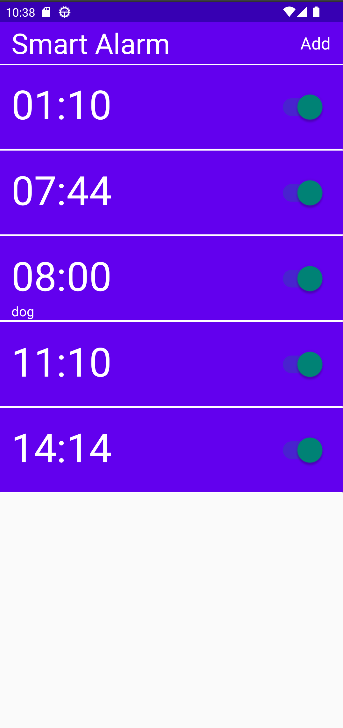
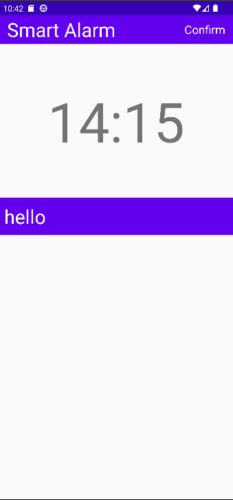
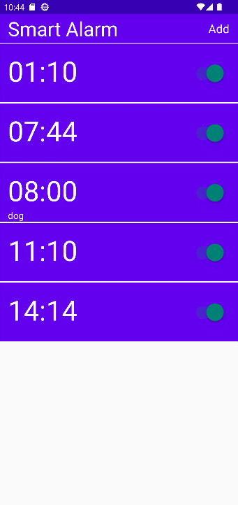
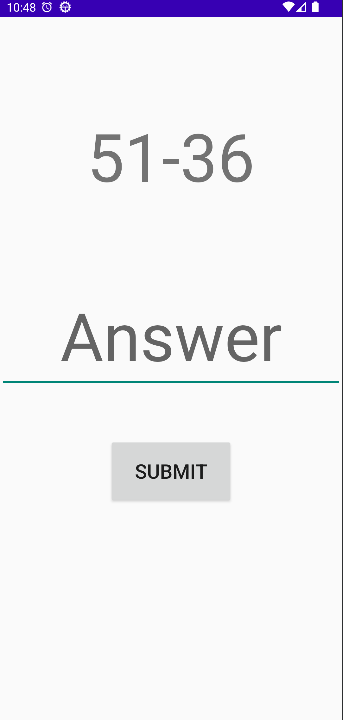

# Будильник с заданиями

## Описание приложения
Приложение представляет менеджер будильников, которые требуют 
решения математического выражения для отключения.
## Добавление и изменение будильника

## Удаление будильника

## Срабатываение будильника
### Уведомление

### Задача

## Технические детали
* База данны - SQLite в связке с библиотекой Room
* Будильники реализованы через PendingIntent и Receiver
* Математические выражения генерируются случайным образом
* Архитектура - MVVM